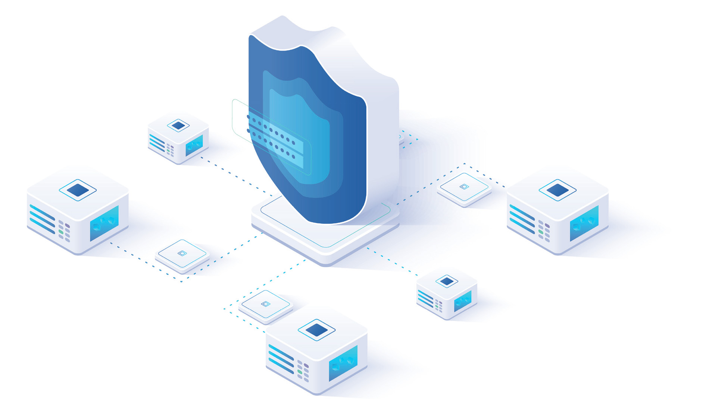

================================================================================
2. Cloud Computing
================================================================================

Cloud Computing is a new paradigm for the use and management of
computing resources and computer services delivered on demand via the
Internet. Cloud services are offered by means of standardized
catalogues. They guarantee services that can be easily and automatically
scaled up depending on load peaks (agility, scalability, elasticity),
and can operate simultaneously and securely on the data and systems of
different users (multi-tenant).

Typically, Cloud services, according to the model of computational
resources offered, are divided into three service models:

1. Infrastructural system services so called
*Infrastructure-as-a-Service (laaS)* for the provision, for example, of
virtualized servers and data storage space;

2. Computational platforms services so called *Platform-as-a-Service
(PaaS)* for the provision of pre-configured and managed environments for
the development of specific applications, e.g. for software development,
data management or containerised applications;

3. Application services so called *Software-as-a-Service (SaaS)* for the
delivery of applications to end users, e.g. e-mail or other remote
collaboration systems.

These different service models allow users of Cloud services to avoid
many of the basic management activities of a data centre’s
infrastructure (such as management of buildings and physical
technological components) and, to simplify the management of initial and
operational configurations of applications and platforms, thus. allowing
considerable economic savings and greater flexibility in managing the
organisations’ demand for new computing resources.

Services are typically provided by *Cloud Service Providers (CSPs)* who
guarantee their operation according to contractually determined levels
(*Service-Level Agreements, SLAs*).

The distribution model of Cloud services can be organised in the
following categories: *Public Cloud, Private Cloud, Hybrid Cloud and
Multi-Cloud*.

2.1 Public Cloud
================================================================================

In the *Public Cloud*, the infrastructure is owned by a CSP which, with
full control, makes its systems available to users, companies and public
bodies in different geographical areas (or regions) of the world,
sharing processing capacity, applications and storage. Such a deployment
allows users of cloud services to benefit from resilient computing
capacities that can be scaled according to actual needs. In the area of
public cloud CSPs, a small group of non-European companies (mainly of US
origin) operate as market leaders. These companies offer Cloud services
with almost unlimited computing capacity through highly sophisticated
technological solutions, so-called ‘hyperscaler’, with high ease of use,
configurability and interoperability.

2.2 Private Cloud
================================================================================

The *Private Cloud* consists of a Cloud environment reserved for an
individual customer for its exclusive use.

This may be on-premise, i.e. based on infrastructures that are entirely
in the domain of the customer, which holds control and full
responsibility for the maintenance and security management of the hosted
data and services, or it may be managed at a third party’s data centre,
where the customer is provided with dedicated resources.

One of the advantages of a Private Cloud is certainly the greater
control that the customer can exert (in terms of choice and contractual
arrangements) over the characteristics of the Cloud infrastructure and
services, especially with regards to security. However, this solution,
particularly in the case of on-premise clouds, presents some
disadvantages as the infrastructure may not be able to guarantee
adequate scalability to handle unforeseen peaks in demand.

2.3 Hybrid Cloud
================================================================================

A combination of the Public and Private Cloud models, the *Hybrid
Cloud*, is a single environment created from several connected
environments in which, depending on need, resources from both a private
and a public Cloud are made available to users. This model extends the
capabilities of a private cloud to use on demand the large-scale
resources available on a Public Cloud, t in order to manage, for
example, sudden peaks in workload; furthermore, it guarantees savings in
terms of the transmission bandwidth needed to exchange data, compared to
what would be possible with a connection to a data centre.

2.4 Multi-Cloud
================================================================================

Multi Cloud refers to a model in which several clouds of the same type
(public or private) offered by different providers are used
simultaneously to implement certain services or applications.

Unlike the Hybrid Cloud, which involves the creation of a single
infrastructure that transparently uses different types of Cloud (public
or private), the Multi Cloud model is based on the use of different
public or private Cloud environments that are not interconnected. In a
Hybrid Cloud environment, the distribution of the use of computational
resources between private and public is typically semi-automated and
transparent to the user, whereas a Multi Cloud environment presents
itself as a set of distinct computational resources that can potentially
be integrated at application level.