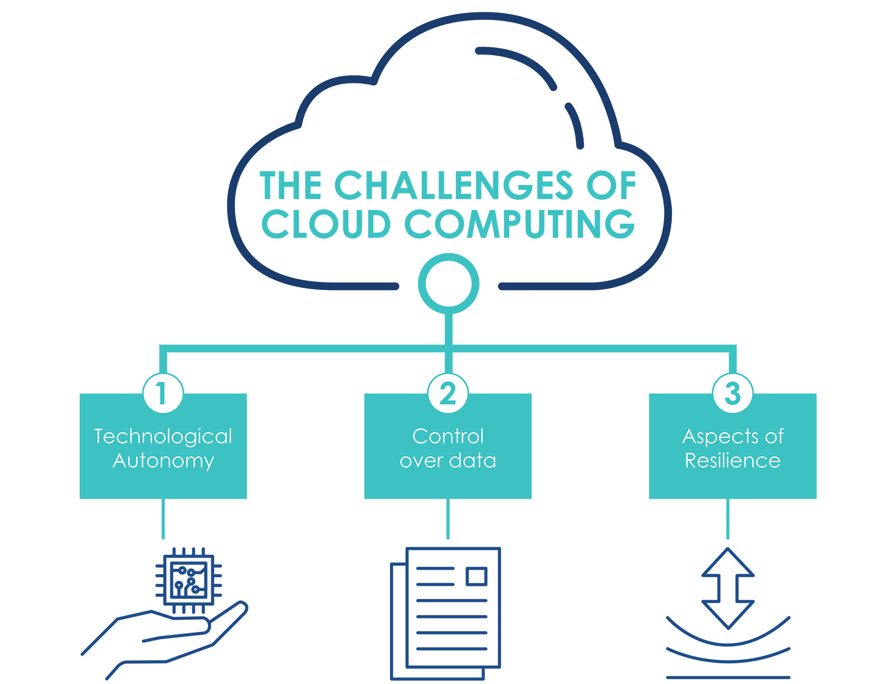

================================================================================
3. The Opportunities and Challenges of Cloud Computing
================================================================================

The adoption of new digital technologies, and the challenges arising
from it are the subject of important EU regulations such as, among
others, Regulations (EU) 2016/679 and 2018/1807 (known as GDPR and free
flow of non-personal data), Directive 2016/1148 (known as the NIS
Directive), and national security legislation, such as Law 133/2019
(National Security Perimeter for Cyber (Perimetro di Sicurezza Nazionale
Cibernetica, PSNC) [2]_.

3.1 Technological Autonomy
================================================================================

In order to govern and manage the country’s digital transformation
processes, as recognised by the main European institutions, autonomy in
the control of the digital infrastructure of the Cloud and,
consequently, of the storage and processing of data appears to have
enormous strategic importance [3]_.

It is well known, however, that the market shares of European companies’
Cloud infrastructures represent a residual value (less than 10%)
compared to those held by non-EU companies [4]_. However, this
criticality is not only limited to digital services and platforms, but
also, and most importantly, to the infrastructures that enable them to
function.

Given such a contractual weakness of the EU, the massive adoption of
Cloud technology for the provision of PA services is subject to risks
such as in the case of unilateral changes in the terms of services:
increased costs or service interruption, or to actions that are
potentially beyond the control of the country. Achieving technological
autonomy has important implications, not only in terms of the
possibility of exerting direct control over data and services, but also
in terms of promoting an ecosystem of technologies (Cloud Computing,
IoT, Artificial Intelligence, Quantum Computing) which is essential for
the country’s development.

3.2 Control over Data
================================================================================

The operation of cloud services by providers in non-EU countries poses
an additional risk due to the regulations in place in those countries.
As it is well known, non-EU legislation [5]_ may allow - provided
certain circumstances - unilateral requests to the CSP to provide access
to data. These cases involve the possibility for a non-EU country to
access data (or data flows) that are particularly sensitive and
strategic for the EU Member States’ citizens and institutions. In this
perspective, within the framework of the strategy, it is necessary to
clearly determine - via a classification procedure - the types of data
that can be managed by a non-EU provider through a Public Cloud and
which data instead will need to be managed by a Cloud provider that
meets specific security requirements in order to reduce the risk that
the data may be accessible to non-EU governments. The management of such
risks does have, inevitably, not only technological but also
geopolitical implications that should receive adequate consideration.

3.3 Aspects of Resilience
================================================================================

Cloud infrastructures and services supporting PA applications and
national essential entities must adopt appropriate procedural and
technical security measures, as well as redundancy and interoperability
operations. The application of layered security controls (e.g.
pseudonymisation, encryption with on-premise key management) in
compliance with the specific requirements of the data processed, as well
as service continuity and disaster recovery measures available
throughout the entire national territory, will increase the level of
resilience against incidents such as cyber attacks and breakdowns.

In particular, although international practices and technical standards
are widely applied by Cloud service providers, given the criticality of
the data and services involved, the Cloud migration strategy requires a
certification process of public Cloud providers and their services. The
qualification must assess not only the security dimension but also the
architectural and organisational aspects which may have negative impacts
on the resilience, e.g. vendor lock-in situations. Another important
direction, in line with the recent initiatives and directives of the
European Digital Agenda [6]_, is the standardisation, harmonisation and
interoperability of Cloud services. Within this context, and with the
aim of developing common requirements for a European data
infrastructure, the GAIA-X project [7]_ was launched; since the
project’s inception Italy had an active involvement in its development.
The project, designed for European based companies, has the objective to
build an open and resilient digital ecosystem through the federation of
cloud services. This ecosystem is built on common standards, ensures
transparency and interoperability, capable of connecting centralised and
decentralised infrastructures, and transforming them into a homogeneous
system.

.. [2]
   Conversion into law, with amendments, of Leg. Decree 21 September
   2019, no. 105, on urgent provisions concerning the National Cyber
   Security Perimeter.

.. [3]
   OECD (2019) Regulation and IRC: challenges posed by the digital
   transformation. 20th meeting of the Regulatory Policy Committee,
   17-18 April 2018, OECD Conference Centre, Paris, France.

.. [4]
   See, for example,
   https://www.gartner.com/en/newsroom/press-releases/2019-07-29-gartner-says-worldwide-iaas-public-cloud-services-market-grew-31point3-percent-in-2018
   and https://www.idc.com/getdoc.jsp?containerId=prUS45552219 and
   https://www.forbes.com/sites/steveandriole/2019/11/20/forrester-research-gets-cloud--computing-trends-right/#5b30ee4468a2.

.. [5]
   Examples are the National Intelligence Law of the People’s Republic
   of China, the Clarifying Lawful Overseas Use of Data Act (CLOUD Act)
   or the Foreign Intelligence Surveillance (FISA).

.. [6]
   https://ec.europa.eu/info/strategy/priorities-2019-2024/europe-fit-digital-age_en

.. [7]
   https://www.data-infrastructure.eu/
