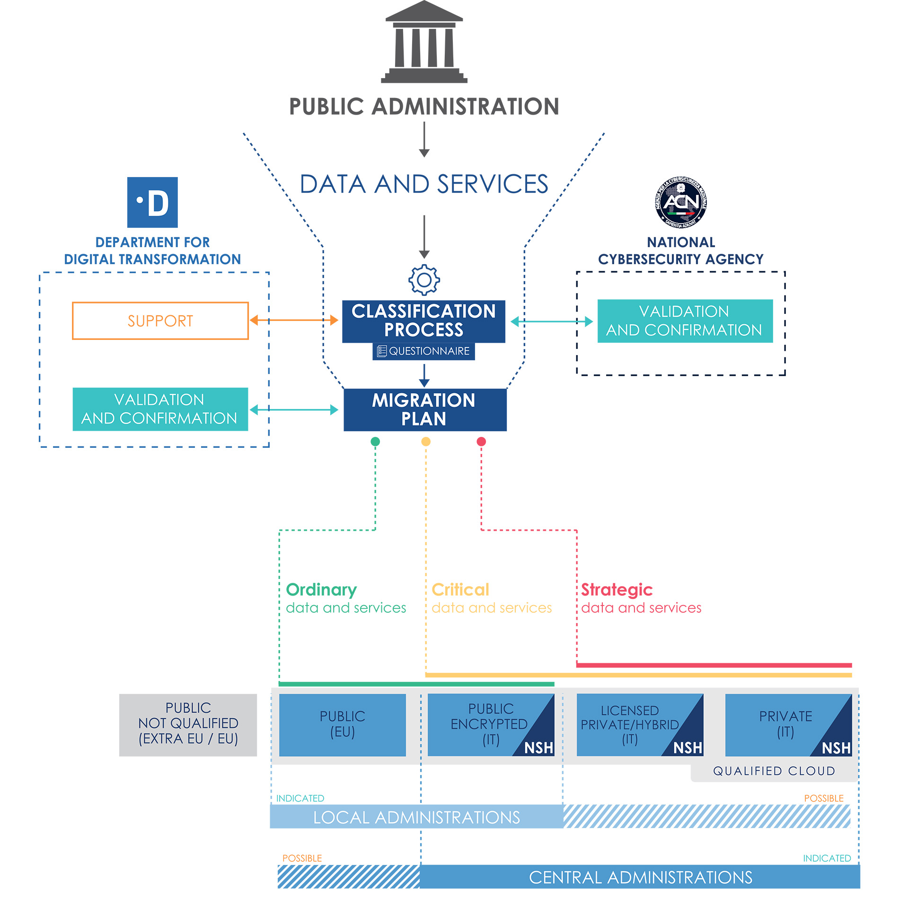

================================================================================
5. Public Administration’s Migration to the Cloud
================================================================================

The migration to Cloud services or the NSH will be governed through a
centralised, smooth and uniform process for all administrations.

Migration plans will then be defined according to the result of the
classification of data and services. The classification and the
migration plans will be defined on the basis of appropriately defined
questionnaires, and will be supported, for their respective profiles, by
the National Cybersecurity Agency (ACN) and the Department for Digital
Transformation (DTD).

This process cannot be separated from the public sector’s
accountability; it will start with identifying and cataloguing the data
and services managed by each PA; consequently it will apply a
categorisation on the basis of the impact of potential data breach,
regulatory constraints and security. The migration plan will be
validated and confirmed by the Department and the Agency in order to
ensure enforcement of the national Cloud strategy.

